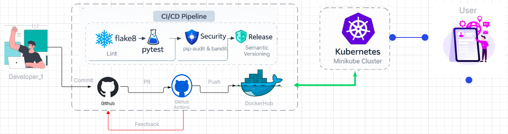
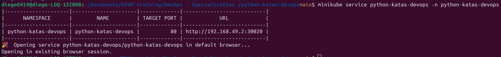
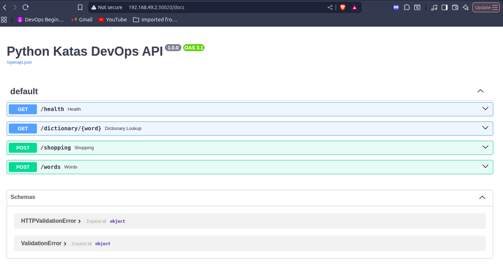

# From Code to Cluster: Python Katas with Full DevOps CI/CD & Kubernetes

## 📌 Project Overview

This project contains a set of **Python katas** (simple problem‑solving exercises) used as a **technical vehicle to demonstrate a complete DevOps workflow**, from source code to **containerized deployment on Kubernetes using Minikube**.

The **Python logic itself is intentionally simple**. The real value of this project lies in how the application is:

* Tested
* Secured
* Versioned
* Built
* Packaged
* Deployed

This project is designed as a **portfolio‑grade DevOps project**, aligned with **real industry CI/CD practices** and expectations for **DevOps Junior / Associate roles**.

---

## 🎯 Goals of the Project

* Apply **real DevOps best practices** to a small Python codebase
* Build a **clean and traceable CI/CD pipeline**
* Automate:

  * Code quality checks
  * Unit testing
  * Security analysis
  * Semantic versioning
  * Docker image creation
* Deploy the application to a **local Kubernetes cluster (Minikube)**
* Demonstrate understanding of **containerized application lifecycle**

---

## 🧠 What Are the Python Katas?

The katas are small Python exercises that solve simple problems such as:

* Finding values in lists or other collections
* Checking if an element exists
* Returning matches based on simple conditions

They are used to:

* Provide testable functionality
* Demonstrate CI quality gates
* Simulate how real services are handled in pipelines

> The katas are not the goal — **the DevOps workflow is**.

---

## 🧱 High‑Level Architecture

```text
Developer
   │
   ├── Git push / Pull Request
   │
   ▼
CI/CD Pipeline
   ├── Lint (flake8)
   ├── Unit Tests (pytest)
   ├── Security Scan (bandit / trivy)
   ├── Semantic Versioning
   ├── Docker Image Build
   ▼
Container Registry (Docker Hub / Local)
   ▼
Kubernetes (Minikube)
   ├── Deployment
   └── Service (NodePort)
```


---

## 🧰 Tools & Technologies Used

### Programming & Testing

* **Python 3.12**
* **pytest** – unit testing
* **flake8** – linting and code style

### CI/CD & Automation

* **GitHub** – source code repository
* **GitHub Actions** – CI/CD pipelines

### Security

* **Bandit** – static code security analysis
* **Trivy** – container vulnerability scanning

### Containers & Kubernetes

* **Docker** – containerization
* **Docker Hub** – image registry
* **Kubernetes** – container orchestration
* **Minikube** – local Kubernetes cluster

---

## 📂 Project Structure

```bash
python-katas-devops/
├── app/
│   ├── api/
│   │   ├── __init__.py
│   │   ├── main.py                           # Application entry point
│   ├── domain/                               # Kata implementations
│   |   ├── dictionary.py
│   |   ├── shopping.py
│   |    └── words.py
│   ├── __init__.py                                
├── k8s/
│   ├── deployment.yaml
│   ├── namespace.yaml
│   └── service.yaml
└── tests/
|    └── domain/
|        ├── dictionary_test.py  
|        ├── shopping_test.py
|        └── words_test.py
├── Dockerfile                                # Production Docker image
├── pyproject.toml
├── README.md
├── requirements.txt

```

---

## 🧪 Code Quality & Testing

### Linting

Code quality is enforced using **flake8**:

```bash
flake8 app/
```

### Unit Tests + Coverage

Unit tests are executed with **pytest**:

```bash
pytest -v
```

Both steps are mandatory **pipeline quality gates**.

---

## 🔐 Security Practices

The pipeline includes security checks at different levels:

* **Bandit**: detects common Python security issues
* **Trivy**: scans Docker images for known vulnerabilities

Security failures break the pipeline, preventing unsafe artifacts from being deployed.

---

## 📦 Semantic Versioning

The project follows **Semantic Versioning (SemVer)**:

```text
MAJOR.MINOR.PATCH
```

Versioning is:

* Automated
* Commit‑driven
* Consistent across builds

Example:

```text
feat: add new kata        → MINOR
fix: handle edge case    → PATCH
```

---

## 🐳 Docker Image

The application is packaged as a Docker image:

```bash
docker build -t python-katas-devops:1.0.0 -f docker/Dockerfile .
```

Run locally:

```bash
docker run --rm -p 8000:8000 python-katas-devops:1.0.0
```

---

## 🔁 CI/CD Pipeline

The CI/CD pipeline is implemented using **GitHub Actions** and is triggered on:

* Push events
* Pull requests

### Pipeline Stages

1. Checkout source code
2. Python environment setup
3. Linting (flake8)
4. Unit testing (pytest)
5. Security scanning (Bandit)
6. Docker image build
7. Docker image push to registry

The pipeline is:

* Fully automated
* Version-controlled
* Reproducible
* Aligned with real-world CI/CD practices

---

## ☸️ Kubernetes Deployment with Minikube

### Prerequisites

* Docker
* kubectl
* Minikube

Start Minikube:

```bash
minikube start
```

### Deploy to Kubernetes

Apply manifests:

```bash
kubectl apply -f k8s/namespace.yaml
kubectl apply -f k8s/deployment.yaml
kubectl apply -f k8s/service.yaml
```

Verify deployment:

```bash
kubectl get namespaces
kubectl get pods
kubectl get svc
```

Access the application:

```bash
minikube service python-katas-devops -python-katas-devops
```


### Service running


This setup simulates **real Kubernetes deployment workflows** in a local environment.

---

## 🧠 DevOps Mindset

This project demonstrates:

* End‑to‑end ownership of the delivery pipeline
* Shift‑left testing and security
* Infrastructure‑aware development
* Kubernetes‑ready applications

---

## 👨‍💻 Author

**Diego López Arango**
Electronic Engineer | DevOps Trainee / Junior

---
